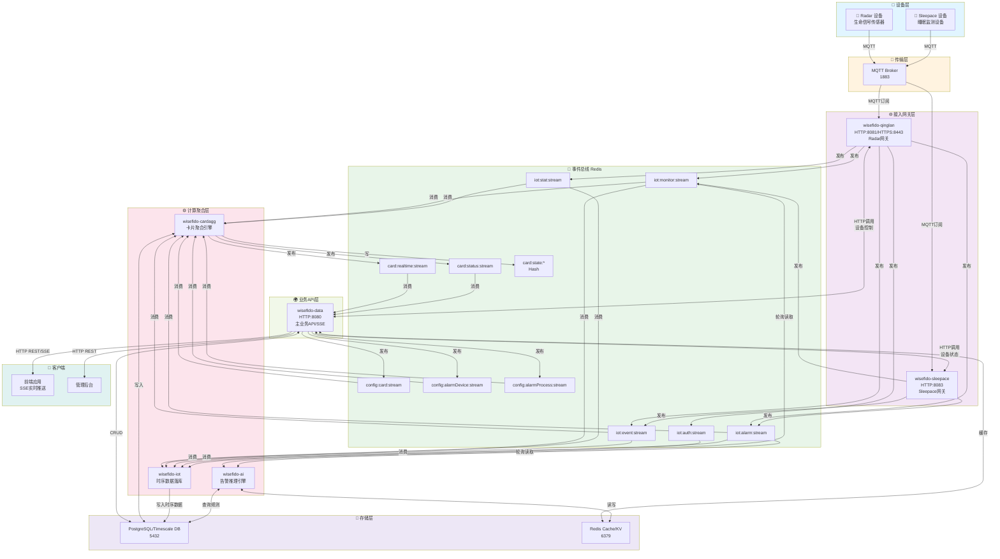
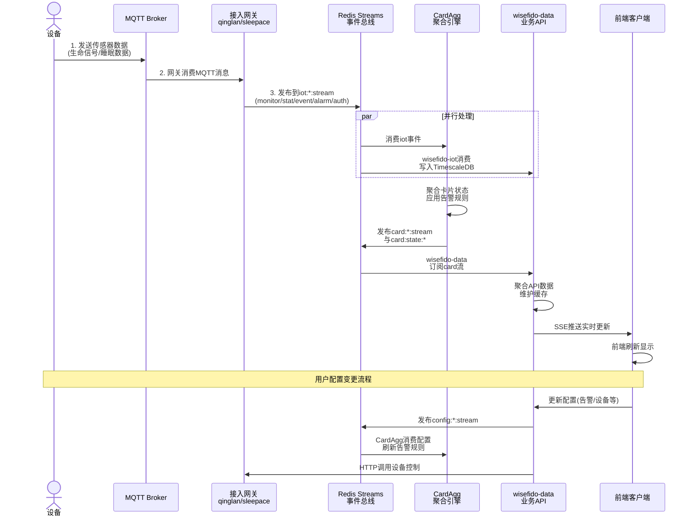
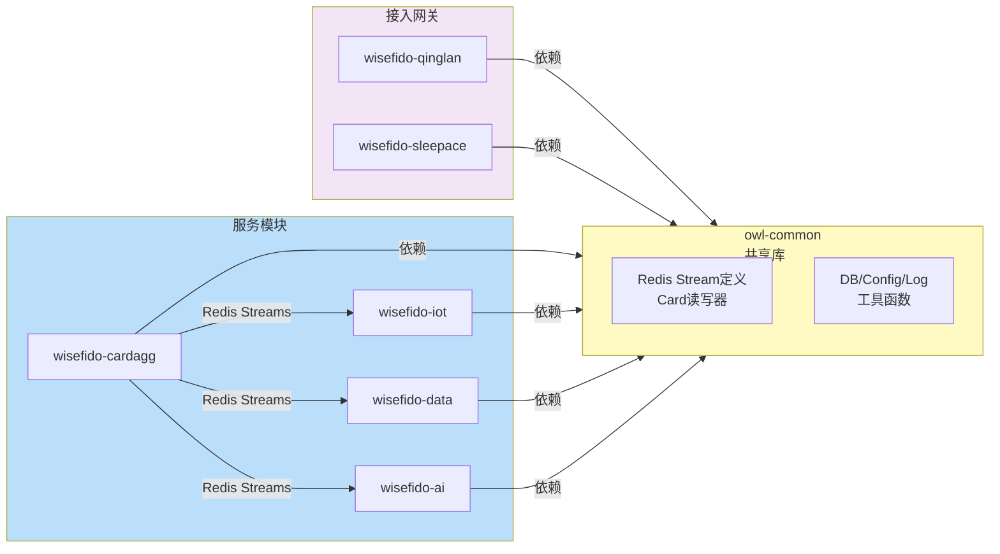
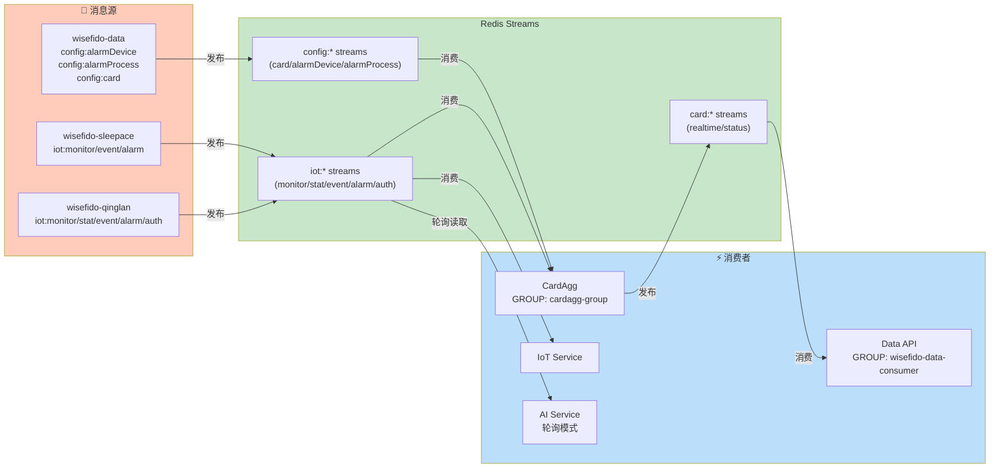
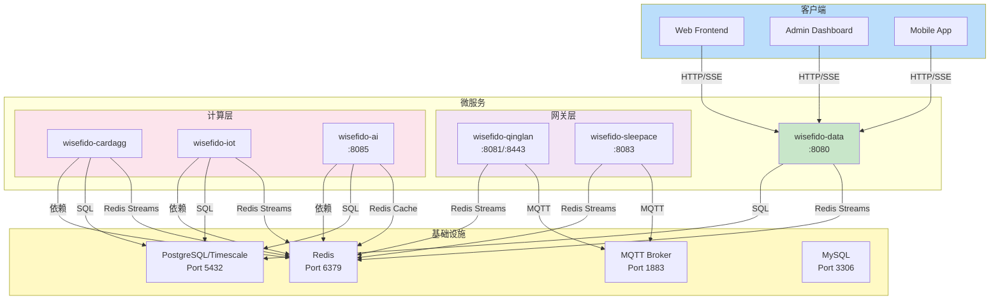

# OwlBack 系统架构图

## 1. 整体系统架构图



## 2. 数据流时序图



## 3. 模块依赖关系图



## 4. Redis Streams 消息流向图



## 5. 部署架构图



## 6. 告警处理流程图

```mermaid
stateDiagram-v2
    [*] --> DataCollection: 设备数据通过网关入站

    DataCollection --> IotStream: 发布到iot:*:stream

    IotStream --> CardAggEnrich: CardAgg消费并聚合

    CardAggEnrich --> RuleEval: 应用告警规则<br/>从config:alarmDevice/Process读取

    RuleEval --> AlarmGen: 生成告警事件
    AlarmGen --> CardStream: 发布到card:realtime:stream<br/>card:status:stream

    CardStream --> DataAPI: wisefido-data订阅<br/>更新卡片状态

    DataAPI --> Notification: 通过SSE推送前端

    Notification --> Frontend: 前端实时显示告警

    Frontend --> [*]

    note right of RuleEval
        支持规则类型:
        - 阈值告警
        - 异常检测
        - 规则推理
    end
```

---

## 核心特性总结

| 特性 | 说明 |
|-----|------|
| **实时数据流** | Redis Streams 实现毫秒级消息传递 |
| **微服务架构** | 6个独立服务，松耦合高内聚 |
| **事件驱动** | 基于Redis Stream的发布-订阅模式 |
| **时序存储** | TimescaleDB用于设备数据长期存储 |
| **消费者组** | Redis Consumer Group支持分布式处理 |
| **SSE实时推送** | wisefido-data通过SSE向前端推送实时数据 |
| **多设备支持** | Radar + Sleepace双设备接入 |
| **告警处理** | CardAgg+AI双引擎告警决策 |

