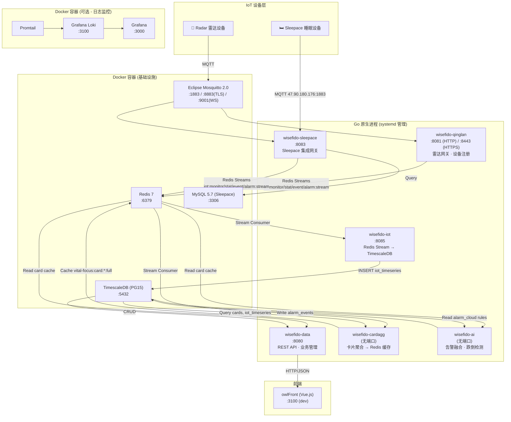

## 部署架构分析

### 部署架构图



### 端口清单

#### 基础设施 (Docker 容器)

| 服务 | 端口 | 协议 | 说明 |
|------|------|------|------|
| **Mosquitto MQTT** | `1883` | TCP | MQTT 标准连接 |
| **Mosquitto MQTT** | `8883` | TCP | MQTT over TLS |
| **Mosquitto MQTT** | `9001` | TCP | MQTT over WebSocket |
| **TimescaleDB** | `5432` | TCP | PostgreSQL 时序数据库 |
| **Redis** | `6379` | TCP | 缓存 + Stream 消息队列 |
| **MySQL** | `3306` | TCP | Sleepace 专用数据库 |

#### Go 应用服务 (原生进程, systemd 管理)

| 服务 | 端口 | 协议 | 职责 |
|------|------|------|------|
| **wisefido-data** | `8080` | HTTP | REST API 入口，设备/住户/单元管理，卡片数据查询 |
| **wisefido-qinglan** | `8081` | HTTP | 雷达网关，设备注册/认证，固件更新 |
| **wisefido-qinglan** | `8443` | HTTPS | 设备 HTTPS 认证端点 |
| **wisefido-sleepace** | `8083` | HTTP | Sleepace 睡眠设备集成网关 |
| **wisefido-iot** | `8085` | HTTP | Redis Stream 消费 → TimescaleDB 持久化 |
| **wisefido-cardagg** | *无* | — | 后台进程：每 2s 聚合卡片数据写入 Redis 缓存 |
| **wisefido-ai** | *无* | — | 后台进程：告警融合、跌倒/离床/访客检测 |

#### 日志监控 (可选 Docker 容器)

| 服务 | 端口 | 说明 |
|------|------|------|
| **Grafana** | `3000` | 日志可视化面板 |
| **Loki** | `3100` | 日志聚合 |

### 数据流概要

```
设备 MQTT → [qinglan/sleepace] → Redis Streams (iot:*:stream)
                                        │
                    ┌───────────────────┤
                    ▼                   ▼
               wisefido-iot        wisefido-cardagg
               (→ PostgreSQL)      (→ Redis Cache)
                                        │
                    ┌───────────────────┤
                    ▼                   ▼
               wisefido-ai         wisefido-data (:8080)
               (告警推理)              (REST API → 前端)
```

### Summary

| 发现 | 等级 |
|------|------|
| 基础设施与应用分离清晰：Docker 管容器化中间件，systemd 管 Go 进程 | 🟢 |
| 服务间通过 Redis Streams 解耦，无直接 RPC 调用 | 🟢 |
| wisefido-cardagg 和 wisefido-ai 无 HTTP 端口，纯后台消费者，职责单一 | 🟢 |
| Mosquitto 开启匿名访问 (`allow_anonymous true`)，生产环境有安全风险 | 🔴 |
| 外部 Sleepace MQTT (`47.90.180.176:1883`) 硬编码在配置中，无故障转移 | 🟡 |
| 所有 Go 服务共享同一 PostgreSQL 实例和 Redis 实例，无读写分离 | 🟡 |
| Go 版本不统一 (1.21 与 1.24.0 混用) | 🟡 |


### 完整连接流程

```
雷达设备上电 (等待8s)
    │
    ▼
HTTPS POST → wisefido-qinglan:8443/auth
    │           • 上报 uid, MCU/Radar 版本, MAC
    │           • 服务端查 device_store 表 → 白名单校验
    ▼
服务端返回 MQTT 连接参数
    │   { server: "10.0.0.30", port: 1883, account: "wfiot", ... }
    ▼
设备用返回的凭证连接 → 10.0.0.30:1883 (MQTT)
    │   ClientID: radar-{uid}
    │   KeepAlive: 60s
    ▼
长连接建立，持续推送数据
    • /monitor/88/{uid}/post  (位置，1Hz)
    • /stat/88/{uid}/post     (统计，1min)
    • /event/88/{uid}/post    (事件)
    • /alarm/88/{uid}/post    (告警)
```

**关键点**：`10.0.0.30:1883` 这个 MQTT broker 和 docker-compose 里的本地 Mosquitto (127.0.0.1:1883) 是**同一台机器的不同访问地址** —— `10.0.0.30` 是该服务器的局域网 IP，设备通过该 IP 从外部访问 Mosquitto。wisefido-qinglan 自身也订阅同一个 broker 来接收设备数据。