# Owl Platform — 系统架构图

> 基于 `owlBack/` 源码与 `docker-compose.yml` 生成，最后更新：2026-03-30

```mermaid
flowchart TB
    %% ===== External Devices =====
    subgraph Devices["External Devices"]
        RadarDevice["Radar Device\n(TDPv2 Protocol)"]
        SleepaceDevice["Sleepace Wearable"]
    end

    %% ===== Clients =====
    subgraph Clients["Clients"]
        OwlFront["owlFront\nVue3 + TypeScript\n:5173"]
        iOSApp["OwlMonitor\niOS App (Swift)"]
    end

    %% ===== Infrastructure (Docker) =====
    subgraph Infra["Docker Infrastructure"]
        MQTT["Eclipse Mosquitto\nMQTT Broker\n:1883 / :8883 / :9001"]
        Redis["Redis 7\n:6379\nStreams / Hash / Pub-Sub"]
        PG["TimescaleDB / PG15\n:5432\nowlrd Database"]
        MySQL["MySQL 5.7\n:3306\nSleepace Data"]
    end

    %% ===== Host Services =====
    subgraph HostServices["Host Services (Go / Java)"]
        subgraph GoServices["Go Microservices"]
            DataSvc["wisefido-data\n:8080\nMain REST API\nAuth / Tenant / User\nDevice / Resident / Alarm\nSSE Push"]
            Qinglan["wisefido-qinglan\n:8081 / :8443\nRadar Gateway\nMQTT Consumer -> Redis Streams"]
            CardAgg["wisefido-cardagg\n:8082\nCard Aggregation\nRedis Streams -> Card State"]
            IoTSvc["wisefido-iot\n:8085\nRedis Streams -> TimescaleDB"]
            SleepaceSvc["wisefido-sleepace\n:8083\nSleepace Gateway\nMQTT -> Redis Streams"]
            AISvc["wisefido-ai\n(Background Polling)\nActivity Recognition / Anomaly Detection"]
        end
        SleepaceJava["sleepace-service\n(Java / Tomcat)\nSleepace Device Protocol Layer"]
    end

    %% ===== External Push =====
    APNs["Apple APNs"]

    %% ===== Redis Streams =====
    subgraph IotStreams["Redis: IoT Streams (iot:*:stream)"]
        direction LR
        MonStream["iot:monitor:stream\n(30s TTL)"]
        AlarmStream["iot:alarm:stream\n(24h TTL)"]
        EventStream["iot:event:stream\n(24h TTL)"]
        StatStream["iot:stat:stream\n(5min TTL)"]
        AuthStream["iot:auth:stream"]
    end

    subgraph ConfigStreams["Redis: Config Streams (config:*:stream)"]
        direction LR
        CardCfg["config:card:stream"]
        AlarmProcCfg["config:alarmProcess:stream"]
        AlarmDevCfg["config:alarmDevice:stream"]
    end

    subgraph CardStreams["Redis: Card Streams and Hash"]
        direction LR
        CardStatus["card:status:stream\n(12h TTL)"]
        CardRealtime["card:realtime:stream\n(6s TTL)"]
        CardStateHash["card:state:{id}\n(Hash)"]
    end

    %% ===== Data Flow =====

    %% Radar Device -> MQTT -> Qinglan -> Redis
    RadarDevice -->|"MQTT TDPv2\ntopic: /wf/{uid}/..."| MQTT
    MQTT -->|"Subscribe device topics"| Qinglan
    Qinglan -->|"Decode TDPv2\nwrite"| MonStream
    Qinglan -->|"write"| AlarmStream
    Qinglan -->|"write"| EventStream
    Qinglan -->|"write"| StatStream
    Qinglan -->|"write"| AuthStream
    Qinglan <-->|"Device command\n(config/control)"| MQTT

    %% Sleepace path
    SleepaceDevice -->|"Vendor protocol"| SleepaceJava
    SleepaceJava -->|"Store"| MySQL
    SleepaceJava <-->|"MQTT data push"| MQTT
    MQTT -->|"Subscribe Sleepace topics"| SleepaceSvc
    SleepaceSvc -->|"write"| MonStream
    SleepaceSvc -->|"write"| AlarmStream
    SleepaceSvc -->|"Proxy HTTP"| SleepaceJava

    %% wisefido-iot: IoT Streams -> TimescaleDB
    MonStream -->|"consumer-group:\niot-timeseries-group"| IoTSvc
    AlarmStream --> IoTSvc
    EventStream --> IoTSvc
    StatStream --> IoTSvc
    IoTSvc -->|"Write time-series data"| PG

    %% wisefido-cardagg: IoT Streams -> Card Streams
    MonStream -->|"consumer-group:\ncardagg-group"| CardAgg
    AlarmStream --> CardAgg
    EventStream --> CardAgg
    CardCfg --> CardAgg
    AlarmProcCfg --> CardAgg
    AlarmDevCfg --> CardAgg

    CardAgg -->|"Update card status"| CardStatus
    CardAgg -->|"Publish realtime vitals"| CardRealtime
    CardAgg -->|"Write Hash"| CardStateHash
    CardAgg -->|"Read card/bed config"| PG
    CardAgg -->|"POST /internal/v1/push/alarm"| DataSvc

    %% wisefido-ai
    AISvc -->|"Read card state"| CardStateHash
    AISvc -->|"Write inference result"| CardStatus

    %% wisefido-data: Card Streams -> SSE
    CardStatus -->|"Subscribe consumer"| DataSvc
    CardRealtime --> DataSvc
    CardStateHash -->|"Read Hash snapshot"| DataSvc
    DataSvc <-->|"CRUD\n(Resident/User/Device/Alarm)"| PG
    DataSvc -->|"SSE cards/stream\ncards/{id}/stream"| OwlFront
    DataSvc -->|"SSE device/{id}/stream"| OwlFront
    DataSvc -->|"APNs push"| APNs
    APNs -->|"Push notification"| iOSApp

    %% owlFront / iOS -> wisefido-data REST
    OwlFront -->|"REST /admin /auth\n/data /radar-device\n/settings /sleepace"| DataSvc
    iOSApp -->|"REST /auth /data /admin"| DataSvc

    %% wisefido-data -> wisefido-qinglan (device control)
    DataSvc -->|"HTTP GET/PUT\n/api/v1/radar/devices/{uid}/..."| Qinglan
    Qinglan -->|"MQTT device command"| MQTT

    %% Config change -> config:* streams
    DataSvc -->|"Write config change"| CardCfg
    DataSvc -->|"Write alarm config change"| AlarmProcCfg
    DataSvc -->|"Write device alarm config"| AlarmDevCfg

    %% Historical data replay
    DataSvc -->|"Historical replay query\n(TimescaleDB)"| PG

    %% Styles
    classDef infra fill:#e8f4f8,stroke:#1a7ab5,color:#000
    classDef gosvc fill:#e8f8e8,stroke:#2e7d32,color:#000
    classDef client fill:#fff8e1,stroke:#f57f17,color:#000
    classDef stream fill:#f3e5f5,stroke:#7b1fa2,color:#000
    classDef device fill:#fce4ec,stroke:#c62828,color:#000
    classDef external fill:#efefef,stroke:#555,color:#000

    class MQTT,Redis,PG,MySQL infra
    class DataSvc,Qinglan,CardAgg,IoTSvc,SleepaceSvc,AISvc gosvc
    class OwlFront,iOSApp client
    class MonStream,AlarmStream,EventStream,StatStream,AuthStream,CardCfg,AlarmProcCfg,AlarmDevCfg,CardStatus,CardRealtime,CardStateHash stream
    class RadarDevice,SleepaceDevice device
    class SleepaceJava,APNs external
```

---

## 服务端口一览

| 服务 | 端口 | 角色 |
|------|------|------|
| wisefido-data | 8080 | 主 REST API / SSE / APNs |
| wisefido-qinglan | 8081 / 8443 | Radar 网关 (HTTP + HTTPS) |
| wisefido-cardagg | 8082 | 卡片聚合引擎 |
| wisefido-sleepace | 8083 | Sleepace 可穿戴网关 |
| wisefido-iot | 8085 | 时序数据写入 (Redis -> TimescaleDB) |
| wisefido-ai | — | 后台推断服务 (轮询) |
| sleepace-service | — | Java 设备协议层 (宿主机) |

## Redis 关键 Stream / Key

| 名称 | 类型 | 生产者 | 消费者 |
|------|------|--------|--------|
| `iot:monitor:stream` | Stream (30s) | qinglan / sleepace | iot / cardagg |
| `iot:alarm:stream` | Stream (24h) | qinglan / sleepace | iot / cardagg |
| `iot:event:stream` | Stream (24h) | qinglan / sleepace | iot / cardagg |
| `iot:stat:stream` | Stream (5min) | qinglan | iot |
| `iot:auth:stream` | Stream | qinglan | iot |
| `config:card:stream` | Stream | wisefido-data | cardagg |
| `config:alarmProcess:stream` | Stream | wisefido-data | cardagg |
| `config:alarmDevice:stream` | Stream | wisefido-data | cardagg |
| `card:status:stream` | Stream (12h) | cardagg / ai | wisefido-data |
| `card:realtime:stream` | Stream (6s) | cardagg | wisefido-data |
| `card:state:{id}` | Hash | cardagg | wisefido-data / ai |

## Docker 容器

| 容器 | 镜像 | 端口 |
|------|------|------|
| owl-postgresql | timescale/timescaledb:latest-pg15 | 5432 |
| owl-redis | redis:7-alpine | 6379 |
| owl-mqtt | eclipse-mosquitto:2.0 | 1883 / 8883 / 9001 |
| sleepace-mysql | mysql:5.7 | 3306 |
