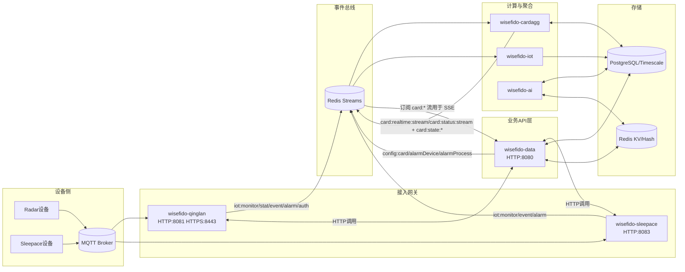

# OwlBack 当前模块架构与快速接手建议

## 1. 架构总览（当前代码主链路）

## 2. 模块职责

- `wisefido-data`
  - 主业务 API、鉴权、租户/组织/设备管理、SSE。
  - 负责发布配置变更事件到 `config:*` streams。
  - 对接 `wisefido-qinglan`（雷达）与 `wisefido-sleepace`（Sleepace 网关）的 HTTP 接口。

- `wisefido-cardagg`
  - 消费 `iot:*` 与 `config:*`，聚合卡片状态。
  - 写 `card:state:{cardID}`（Hash）并推送 `card:status:stream` / `card:realtime:stream`。

- `wisefido-qinglan`
  - 雷达设备接入网关：MQTT 入站，发布统一 `iot:*` streams。
  - 提供设备控制 HTTP API 与设备认证 HTTPS API。

- `wisefido-sleepace`
  - Sleepace 设备网关：消费 sleepace MQTT，发布 `iot:*` streams。
  - 提供 Sleepace 代理接口与设备状态接口。

- `wisefido-iot`
  - 消费统一 `iot:*` streams，落库到 `iot_timeseries`（TimescaleDB）。
  - 提供内部 API（例如缓存失效）。

- `wisefido-ai`
  - 当前主启动路径为轮询模式：按租户遍历卡片，从 Redis 读取实时 key 做规则/推理并写报警缓存。

- `owl-common`
  - 跨服务公共库：Redis stream 定义、card reader/writer、DB/MQTT/log/config 封装。

## 3. 核心消息与数据流

- 设备入站：`设备 -> MQTT -> qinglan/sleepace -> iot:*:stream`
- 时序落库：`iot:*:stream -> wisefido-iot -> PostgreSQL/Timescale`
- 卡片聚合：`iot:* + config:* -> wisefido-cardagg -> card:state:* + card:*:stream`
- 前端实时：`wisefido-data` 订阅 `card:realtime:stream` / `card:status:stream`，SSE 推送前端。
- 配置下发闭环：
  - `wisefido-data` 更新配置 -> 发布 `config:alarmDevice:stream` / `config:alarmProcess:stream` / `config:card:stream`
  - `wisefido-cardagg` 消费后刷新告警状态、缓存、映射。

## 4. 快速接手执行清单（建议顺序）

1. 启动并确认服务拓扑
   - 运行：`./start-owlback.sh`
   - 检查：`./ServiceStatus.sh`
   - 确认端口：`8080/8081/8083/8085` 与基础设施 `5432/6379/1883/3306`

2. 分三段验证链路（避免端到端黑盒）
   - 段 A：`MQTT -> iot:*:stream`
   - 段 B：`iot:*:stream -> cardagg -> card:*:stream / card:state:*`
   - 段 C：`wisefido-data API/SSE` 是否拿到卡片实时与状态

3. 优先阅读入口文件（一天内建立全局心智模型）
   - `wisefido-data/cmd/wisefido-data/main.go`
   - `wisefido-cardagg/main.go`
   - `wisefido-qinglan/cmd/wisefido-qinglan/main.go`
   - `wisefido-sleepace/cmd/wisefido-sleepace/main.go`
   - `wisefido-iot/cmd/wisefido-iot/main.go`
   - `owl-common/redis/stream_names.go`

4. 先固化“消息契约清单”
   - 每个 stream 的字段与语义（`tenant_id/card_id/device_id/topic_type/category/dataValue`）
   - 哪些字段是必填、哪些是兜底、哪些由下游补齐

5. 接手初期重点风险（优先核对）
   - AI 读取 `vital-focus:card:{id}:realtime`，但主实时链路已转向 `card:realtime:stream`；需确认该 key 当前是否仍有稳定生产者。
   - qinglan/sleepace 代码中有 config subscriber 实现，但主流程注释说明“不再订阅 config:card:stream”；需要确认实际运行路径与文档一致，避免误判耦合关系。

## 5. 接手后第一周建议产出

- 产出 1：`消息契约表`（stream -> producer -> consumer -> schema -> SLA）
- 产出 2：`运行手册`（启动顺序、排障命令、日志关键字）
- 产出 3：`差异清单`（代码现状 vs 旧文档，特别是 card 缓存与 AI 数据源）
- 产出 4：`最小回归脚本`（模拟一条设备消息，验证 iot/cardagg/data 三段）

---

备注：本文件基于当前仓库代码与启动脚本梳理，适合作为后续架构评审与新人 onboarding 的基线文档。
